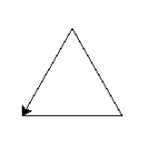

# Instructions  

Draw the following shape using Python Turtle. It doesn't have to be
perfectly like the one below, a close approximation will do.

**Note:** The cursor can be pointing in a different direction for your attempt

## Python Turtle Instructions Summary
| Function Name   | Parameters          | Description                                                                                     |
|-----------------|---------------------|-------------------------------------------------------------------------------------------------|
| speed()         | speed (0 to 10)     | Sets the speed of the turtle, where 0 is the fastest and 10 is the slowest.                     |
| forward()       | distance            | Moves the turtle forward by the specified distance.                                             |
| backward()      | distance            | Moves the turtle backward by the specified distance.                                            |
| right()         | angle               | Turns the turtle clockwise by the specified angle in degrees.                                   |
| left()          | angle               | Turns the turtle counterclockwise by the specified angle in degrees.                            |
| penup()         | None                | Lifts the pen, so that the turtle doesn't draw when it moves.                                   |
| pendown()       | None                | Puts the pen down, so that the turtle draws when it moves.                                      |
| pensize()       | width               | Sets the width of the lines drawn by the turtle to the specified value.                         |
| pencolor()      | color               | Sets the color of the pen. You can use color names ('red') or RGB values ((1, 0, 0)).           |
| fillcolor()     | color               | Sets the color that is used to fill shapes. Like pencolor, can use names or RGB values.        |
| begin_fill()    | None                | Starts filling the shape that is being drawn. Must be followed eventually by end_fill().       |
| end_fill()      | None                | Fills the shape drawn after the last call to begin_fill() with the color set by fillcolor().   |
| goto()          | x, y                | Moves the turtle to an absolute position. If the pen is down, it will draw a line.             |
| setheading()    | angle               | Sets the orientation of the turtle to an absolute angle. 0 is east, 90 is north etc.           |
| circle()        | radius, extent=None | Draws a circle with the given radius. The extent parameter is optional to draw part of a circle|
| clear()         | None                | Clears the screen and the turtle’s drawings.                                                    |
| reset()         | None                | Clears the screen and resets the turtle to its original position.                               |
| done()          | None                | Completes the drawing and closes the Turtle graphics window.                                    |
